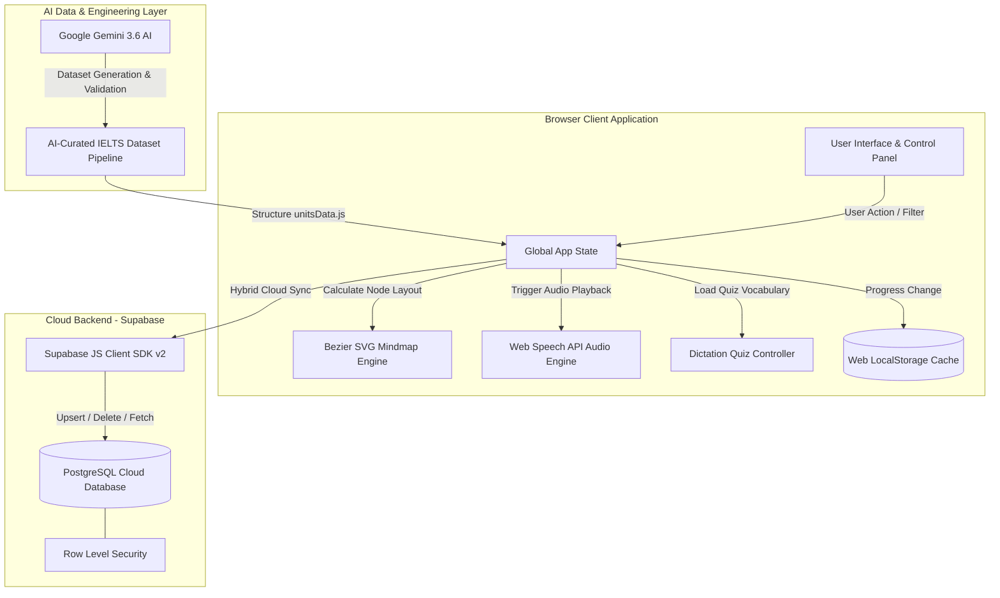

# 🗺️ IELTS Vocab Mindmap

[](https://ielts-vocab-mindmap.pages.dev/)
[](https://deepmind.google/technologies/gemini/)
[](https://supabase.com)
[](https://developer.mozilla.org/en-US/docs/Web/API/Web_Speech_API)
[-F7DF1E?logo=javascript&logoColor=black)](https://developer.mozilla.org)
[](https://opensource.org/licenses/MIT)

 English | [繁體中文](README.zh-TW.md)

🌐 **Live Application**: [https://ielts-vocab-mindmap.pages.dev/](https://ielts-vocab-mindmap.pages.dev/)

**IELTS Vocab Mindmap** is an interactive, visual, and data-driven IELTS & General English scenario vocabulary learning platform. Co-engineered with **Google Gemini 3.6 AI**, the platform combines an AI-curated exam dataset across 15 scenario units with a dynamic SVG Bezier curve engine, Web Speech API audio synthesis, and a hybrid dual-layer storage sync backed by Supabase PostgreSQL.

---

## 🤖 AI-Driven Development & Architecture

This project showcases a **Human-in-the-Loop AI Engineering Workflow**, leveraging cutting-edge LLMs to accelerate development velocity and elevate data quality:

- 🧠 **AI Data Pipeline & Curation**: Utilized **Google Gemini 3.6** to generate, validate, and structure 15 high-frequency IELTS scenario vocabulary datasets (`unitsData.js`), ensuring precise IPA phonetics, contextual exam collocations, and authentic sample sentences.
- ⚡ **AI Co-Engineered Codebase**: Architected in collaboration with Google Antigravity & Gemini 3.6 AI pair programming for rapid prototyping of custom SVG Bezier math engines and cloud storage synchronization.
- 🔮 **Future AI Integration Roadmap**:
  - [ ] **AI Adaptive Learning Engine**: Dynamic difficulty adjustment based on user spelling quiz performance.
  - [ ] **LLM-Powered Writing & Speaking Assistant**: Real-time AI feedback on student sentence construction using learned IELTS vocabulary.
  - [ ] **AI Voice Tutor**: Conversational speaking drills leveraging Web Speech API and LLM agents.

---

## 🌟 Key Features

- 📚 **15 Complete IELTS Scenario Units (150+ Core Vocabulary Items)**:
  - **Unit 1: Accommodation** 🏠 Hand-drawn Cottage & Living Environment
  - **Unit 2: Campus Life** 🎓 Academic Life & Graduation Cap
  - **Unit 3: Travel & Tourism** ✈️ Globe & Flight Travel
  - **Unit 4: Health & Medical** 🩺 First Aid Kit & ECG Waveform
  - **Unit 5: Work & Career** 💼 Office Tower & Executive Briefcase
  - **Unit 6: Environment & Nature** 🌿 Green Earth & Nature Conservation
  - **Unit 7: Banking & Services** 💳 Banking Hall & Credit Card Services
  - **Unit 8: Food & Dining** 🍔 Culinary Plate & Dining Cutlery
  - **Unit 9: Entertainment & Sports** 🎨 Artist Palette & Sports Field
  - **Unit 10: Science & Technology** 🔬 Microscope & AI Semiconductor Chip
  - **Unit 11: Education & Learning** 📚 Academic Pedagogy & E-Learning
  - **Unit 12: Media & Communication** 📡 Mass Media, Journalism & Social Networks
  - **Unit 13: Law, Crime & Society** ⚖️ Justice System, Rehabilitation & Safety
  - **Unit 14: Culture, Art & History** 🏛️ Archeology, Heritage & Fine Arts
  - **Unit 15: Transportation & Planning** 🚆 Public Transit, Congestion & Urbanization
- 🎨 **Dynamic Bezier Curve Mindmap Engine**: Computes smooth SVG quadratic/cubic Bezier curves dynamically between central topic hubs and vocabulary cards.
- 🔊 **Web Speech API Audio Synthesis**: Native audio pronunciation for individual words and example sentences with `1.0x` standard speed and `0.75x` slow intensive listening mode.
- ✏️ **Dictation Quiz & Streak System**: Interactive spelling quizzes for single units or all 15 scenario units with real-time scoring and streak counting.
- ☁️ **Supabase Cloud Sync & Hybrid Storage**: Instant local storage updates backed by background cloud synchronization to Supabase PostgreSQL (`user_learned_words`).
- 👁️ **Flashcards & Chinese Masking Mode**: One-click toggle to mask Chinese definitions for memory self-testing.
- 🔍 **Instant Dual-Language Filter & Band Selector**: Real-time filtering by English/Chinese keywords, IPA phonetics, and IELTS Band levels (Band 6.0 ~ 8.5+).

---

## 🏗️ System Architecture



---

## 🛠️ Technology Stack

| Layer | Technology / Tools | Details & Responsibilities |
| :--- | :--- | :--- |
| **AI Co-Engineering** | Google Gemini 3.6 AI | Dataset curation across 15 units, phonetics validation, and AI pair programming. |
| **Frontend Core** | HTML5, Vanilla JavaScript (ES6+), CSS3 | Zero framework dependency; ultra-fast initial page render (<50ms). |
| **Visualization Engine** | Dynamic SVG & Bezier Curve Math | Real-time coordinate calculation and SVG path rendering (`d="M ... Q ... T ..."`). |
| **Audio Synthesis** | Web Speech API (`window.speechSynthesis`) | Browser-native TTS pronunciation with customizable speech rate (`0.75x` / `1.0x`). |
| **Cloud Database** | Supabase (PostgreSQL 15+) | Managed cloud PostgreSQL database integration via `@supabase/supabase-js`. |
| **Client Storage** | Web Storage API (`localStorage`) | Client-side cache supporting offline access and instant UI responsiveness. |
| **Deployment** | Cloudflare Pages | Edge network deployment for global ultra-low latency. |

---

## 🗄️ Database Design

The application implements a **Hybrid Dual-Storage Strategy**. User learning progress is stored locally in `localStorage` for zero-latency UI responsiveness and synced asynchronously with Supabase cloud database when connected.

### PostgreSQL Schema (`user_learned_words`)

```sql
-- Create Table for tracking user's learned vocabulary progress
CREATE TABLE IF NOT EXISTS public.user_learned_words (
    id UUID PRIMARY KEY DEFAULT gen_random_uuid(),
    user_id TEXT NOT NULL,
    word TEXT NOT NULL,
    unit_id TEXT,
    created_at TIMESTAMPTZ DEFAULT NOW(),

    -- Unique constraint for idempotent upserts per user
    CONSTRAINT unique_user_word UNIQUE (user_id, word)
);

-- Index for fast lookup by user_id
CREATE INDEX IF NOT EXISTS idx_user_learned_words_user_id 
ON public.user_learned_words (user_id);
```

---

## 📂 Project Structure

```
ielts-vocab-mindmap/
├── index.html         # Main HTML layout, controls, modals, and panel UI
├── unitsData.js       # AI-curated 15 Scenario Units dataset (Words, IPA, examples & SVGs)
├── script.js          # Controller: Bezier SVG engine, Web Speech TTS, Quiz & Supabase sync
├── style.css          # Design system, glassmorphism UI, themes & responsive breakpoints
├── .env.example       # Template for Supabase credentials & project configurations
├── README.md          # Primary English Documentation
├── README.zh-TW.md    # Traditional Chinese Documentation
└── .gitignore         # Git ignore rules
```

---

## 🚀 Quick Start & Live Demo

### 🌐 Live Demo
Experience the live application deployed on Cloudflare Pages:
👉 **[https://ielts-vocab-mindmap.pages.dev/](https://ielts-vocab-mindmap.pages.dev/)**

### Local Development
Simply clone and open `index.html` in your browser:

```bash
# Clone the repository
git clone https://github.com/b1uewave/ielts-vocab-mindmap.git

# Navigate to project directory
cd ielts-vocab-mindmap

# Open index.html in your default browser (macOS)
open index.html
```

---

## 🏷️ Release & Versioning

This project follows [Semantic Versioning](https://semver.org/). 

### Current Release: `v1.0.0`
- AI-Co-Engineered 15 complete IELTS scenario units using Google Gemini 3.6.
- Dynamic SVG Bezier mindmap visualization engine.
- Web Speech API integration with dual speech speed options.
- Dictation Spelling Quiz with streak counter.
- Supabase cloud database & hybrid local sync architecture.
- Deployed on Cloudflare Pages.

---

## 📝 License

This project is licensed under the MIT License - see the [LICENSE](LICENSE) file for details.

© 2026 ielts-vocab-mindmap
