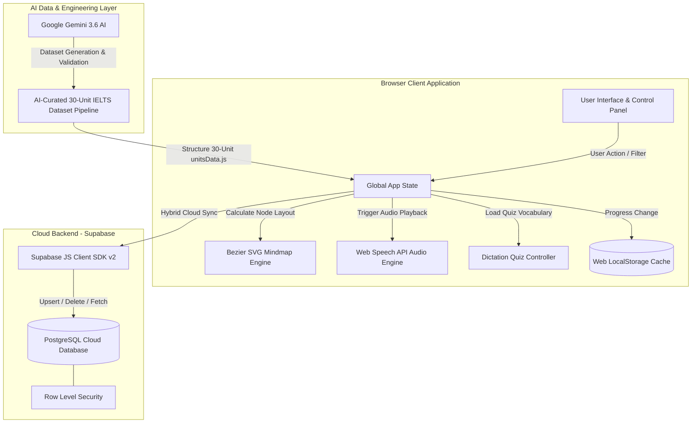

# 🗺️ IELTS Vocab Mindmap

[](https://ielts-vocab-mindmap.pages.dev/)
[](https://deepmind.google/technologies/gemini/)
[](https://supabase.com)
[](https://developer.mozilla.org/en-US/docs/Web/API/Web_Speech_API)
[-F7DF1E?logo=javascript&logoColor=black)](https://developer.mozilla.org)
[](https://opensource.org/licenses/MIT)

 English | [繁體中文](README.zh-TW.md)

🌐 **Live Application**: [https://ielts-vocab-mindmap.pages.dev/](https://ielts-vocab-mindmap.pages.dev/)

**IELTS Vocab Mindmap** is an interactive, visual, and data-driven IELTS & General English scenario vocabulary learning platform. Co-engineered with **Google Gemini 3.6 AI**, the platform combines an AI-curated Cambridge IELTS exam dataset across **30 scenario units (1,148 core high-frequency words)** with a dynamic SVG Bezier curve engine, 100% unique educational flashcard SVG illustrations, Web Speech API audio synthesis, and a hybrid dual-layer storage sync backed by Supabase PostgreSQL.

---

## 🤖 AI-Driven Development & Architecture

This project showcases a **Human-in-the-Loop AI Engineering Workflow**, leveraging cutting-edge LLMs to accelerate development velocity and elevate data quality:

- 🧠 **AI Data Pipeline & Curation**: Utilized **Google Gemini 3.6** to generate, validate, and structure **30 high-frequency IELTS scenario vocabulary datasets** (`unitsData.js`), ensuring 1,148 words complete with precise IPA phonetics, IELTS Band target levels (Band 5.0 ~ 7.5+), authentic sample sentences, and exam tips.
- 🎨 **100% Unique Educational Vector Art Engine**: Generated 1,148 dedicated, non-repetitive educational flashcard SVG illustrations with crisp white backgrounds and domain-matched visual metaphors.
- ⚡ **AI Co-Engineered Codebase**: Architected in collaboration with Google Antigravity & Gemini 3.6 AI pair programming for rapid prototyping of custom SVG Bezier math engines and cloud storage synchronization.
- 🔮 **Future AI Integration Roadmap**:
  - [ ] **AI Adaptive Learning Engine**: Dynamic difficulty adjustment based on user spelling quiz performance.
  - [ ] **LLM-Powered Writing & Speaking Assistant**: Real-time AI feedback on student sentence construction using learned IELTS vocabulary.
  - [ ] **AI Voice Tutor**: Conversational speaking drills leveraging Web Speech API and LLM agents.

---

## 🌟 Key Features

- 📚 **30 Complete IELTS Scenario Units (1,148 Core High-Frequency Exam Vocabulary Items)**:
  - **Unit 1: Accommodation** 🏠 Living Environment, Facilities & Leasing (60 words)
  - **Unit 2: Campus Life** 🎓 Academic Life, Courses & Dissertations (44 words)
  - **Unit 3: Travel & Tourism** ✈️ Flight Booking, Itineraries & Formalities (37 words)
  - **Unit 4: Health & Medical** 🩺 Consultations, Symptoms & Treatments (33 words)
  - **Unit 5: Work & Career** 💼 Recruitment, Employment & Compensation (34 words)
  - **Unit 6: Environment & Nature** 🌿 Climate Change, Ecosystems & Conservation (33 words)
  - **Unit 7: Banking & Services** 💳 Financial Accounts, Postal Services & Audits (35 words)
  - **Unit 8: Food & Dining** 🍔 Culinary Arts, Nutrition & Hygiene (37 words)
  - **Unit 9: Entertainment & Sports** 🎨 Fine Arts, Pastimes & Athletics (35 words)
  - **Unit 10: Science & Technology** 🔬 Computer Science, Big Data & Robotics (34 words)
  - **Unit 11: Education & Learning** 📚 Pedagogy, Curricula & Academic Rigor (36 words)
  - **Unit 12: Media & Communication** 📡 Mass Media, Journalism & Broadcasting (35 words)
  - **Unit 13: Law, Crime & Society** ⚖️ Justice System, Statutes & Rehabilitation (34 words)
  - **Unit 14: Culture, Art & History** 🏛️ Archeology, Heritage & Artifacts (33 words)
  - **Unit 15: Transportation & Planning** 🚆 Transit Hubs, Infrastructure & Congestion (40 words)
  - **Unit 16: Business & Entrepreneurship** 📈 Corporate Strategy, Startups & IPOs (40 words)
  - **Unit 17: Psychology & Human Behavior** 🧠 Cognition, Resilience & Emotion (40 words)
  - **Unit 18: Energy & Global Climate** ⚡ Clean Energy, Wind Turbines & Carbon Sinks (39 words)
  - **Unit 19: Architecture & Design** 🏢 Blueprints, Structural Aesthetics & Zoning (41 words)
  - **Unit 20: Globalization & Immigration** 🌐 Cultural Assimilation, Migration & Trade (39 words)
  - **Unit 21: Agriculture & Food Security** 🌾 Sustainable Farming, Crops & Livestock (40 words)
  - **Unit 22: Philosophy & Social Values** 💡 Ethics, Moral Reasoning & Civic Duty (36 words)
  - **Unit 23: Astronomy & Space Exploration** 🪐 Planetary Systems, Nebulae & Cosmos (35 words)
  - **Unit 24: Geology & Earth Sciences** 🌋 Seismology, Plate Tectonics & Volcanism (38 words)
  - **Unit 25: Industry & Logistics** ⚙️ Supply Chains, Manufacturing & Automation (40 words)
  - **Unit 26: Zoology & Wildlife Ecology** 🦁 Fauna Conservation, Ecosystems & Habitats (40 words)
  - **Unit 27: Fashion, Textiles & Consumerism** 👗 Fast Fashion, Retail Trends & Consumer Culture (40 words)
  - **Unit 28: Nutrition & Food Science** 🍎 Metabolism, Dietary Nutrients & Public Health (40 words)
  - **Unit 29: Urban Planning & Infrastructure** 🏙️ Smart Cities, Grid Utilities & Public Transit (40 words)
  - **Unit 30: Academic Research & Methodology** 📊 Empirical Data, Hypotheses & Peer Review (40 words)
- 🎨 **Dynamic Bezier Curve Mindmap Engine**: Computes smooth SVG quadratic/cubic Bezier curves dynamically between central topic hubs and vocabulary cards.
- 🎨 **100% Word-Specific Educational Vector Art Icons**: Clean minimal flat-style SVG icons for all 1,148 words with 0% fallback cross repetition.
- 🔊 **Web Speech API Audio Synthesis**: Native audio pronunciation for individual words and example sentences with `1.0x` standard speed and `0.75x` slow intensive listening mode.
- ✏️ **Dictation Quiz & Streak System**: Interactive spelling quizzes across all 30 scenario units with real-time scoring and streak tracking.
- ☁️ **Supabase Cloud Sync & Hybrid Storage**: Instant local storage updates backed by background cloud synchronization to Supabase PostgreSQL (`user_learned_words`).
- 👁️ **Flashcards & Chinese Masking Mode**: One-click toggle to mask Chinese definitions for memory self-testing.
- 🔍 **Instant Dual-Language Filter & Band Selector**: Real-time filtering by English/Chinese keywords, IPA phonetics, and IELTS Band levels (Band 5.0 ~ 7.5+).

---

## 🏗️ System Architecture



---

## 🛠️ Technology Stack

| Layer | Technology / Tools | Details & Responsibilities |
| :--- | :--- | :--- |
| **Frontend UI** | Vanilla HTML5 / CSS3 / ES6+ JavaScript | Zero build-step architecture, Glassmorphism UI, Responsive CSS Grid |
| **Mindmap Rendering** | SVG Bezier Math Engine | Dynamic quadratic/cubic Bezier curves linking topic hubs to cards |
| **Icon System** | Educational Vector SVG Icons | 1,148 custom, word-specific minimal flat vector art icons |
| **Audio Engine** | Web Speech API (`SpeechSynthesis`) | Dual-speed (`1.0x` / `0.75x`) native pronunciation for words and sentences |
| **Database & Cloud** | Supabase PostgreSQL & JS SDK v2 | Real-time cloud sync for user learning progress (`user_learned_words`) |
| **State & Local Storage**| LocalStorage + Event-driven Bus | Offline-first data caching with fallback capabilities |
| **Deployment** | Cloudflare Pages | Global Edge CDN hosting with zero latency |
| **AI Co-Engineer** | Google Gemini 3.6 & Antigravity | AI Data Pipeline for 30 IELTS units & pair programming |

---

## 🚀 Quick Start

### 1. Direct Local Execution (Zero Build Required)
Simply clone the repository and open `index.html` in any web browser:
```bash
git clone https://github.com/b1uewave/ielts-vocab-mindmap.git
cd ielts-vocab-mindmap
open index.html
```

### 2. Local HTTP Web Server
For testing Web Speech API and Supabase network requests:
```bash
npx serve ./
# or
npx live-server ./
```
Then navigate to `http://localhost:3000` or `http://127.0.0.1:8080`.

---

## 📄 License

This project is licensed under the [MIT License](LICENSE).
