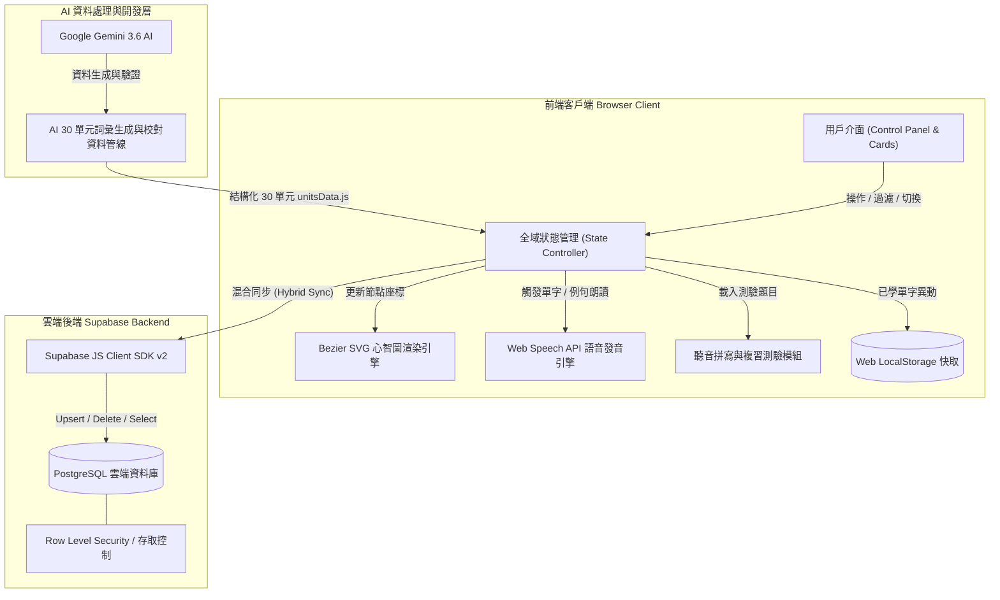

# 🗺️ IELTS Vocab Mindmap (雅思視覺化單字心智圖)

[](https://ielts-vocab-mindmap.pages.dev/)
[](https://deepmind.google/technologies/gemini/)
[](https://supabase.com)
[](https://developer.mozilla.org/en-US/docs/Web/API/Web_Speech_API)
[-F7DF1E?logo=javascript&logoColor=black)](https://developer.mozilla.org)
[](https://opensource.org/licenses/MIT)

[English](README.md) | 繁體中文

🌐 **線上展示網址**: [https://ielts-vocab-mindmap.pages.dev/](https://ielts-vocab-mindmap.pages.dev/)

`ielts-vocab-mindmap` 是一個互動式、視覺化且資料驅動的雅思/英語場景單字心智圖學習平台。本專案採用 **Google Gemini 3.6 AI 人工智慧協同開發 (Human-in-the-Loop AI Engineering)**，將 AI 生成與校對的 **30 大全真題考題主題單元（共 1,148 個精純黃金考點單字）**與動態 Bezier 貝茲曲線 SVG 心智圖渲染引擎、100% 獨立專屬教育字卡向量 SVG 圖示、Web Speech API 真人語音朗讀，以及 Supabase PostgreSQL 雲端/本機快取混合同步架構完美結合。

---

## 🤖 AI 驅動開發流程與未來規劃 (AI-Driven Engineering & Roadmap)

本專案展現現代開發者運用 **AI 工具進行增程開發與資料處理 (Human-in-the-Loop AI Engineering)** 的能力：

- 🧠 **AI 資料處理管線 (AI Data Pipeline)**：使用 **Google Gemini 3.6** 生成、校對並結構化 **30 大雅思核心高頻場景詞彙庫** (`unitsData.js`)，確保全站 1,148 個單字皆備齊國際音標 (IPA)、目標 Band 分數 (Band 5.0 ~ 7.5+)、精準中文釋義、擬真考題句型與考試提示。
- 🎨 **100% 獨立專屬教育字卡向量插圖**：為 1,148 個單字各自繪製獨立、極簡扁平向量 SVG 圖示 (Educational Flashcard Vector Art)，達到 0% 備用圖示重複率。
- ⚡ **AI 協同程式碼架構 (AI Co-Engineered Codebase)**：與 Google Antigravity & Gemini 3.6 進行 AI 結對編程 (Pair Programming)，快速產出貝茲曲線數學演算、SVG 節點動態定位與雲端資料庫混合同步邏輯。
- 🔮 **未來 AI 功能擴展路線圖 (Future Roadmap)**：
  - [ ] **AI 自適應學習引擎**：根據使用者聽音拼寫錯題率，動態調整複習頻率與題目難易度。
  - [ ] **LLM 寫作與口說造句批改助教**：運用 AI 即時評估學生使用當前單元單字所撰寫的句子。
  - [ ] **AI 語音對話陪練**：結合 Web Speech API 與 AI Agent 實現口說情境模擬對話。

---

## 🌟 核心特色 (Features)

- 📚 **30 大雅思全真題主題單元 (包含 1,148 個精純黃金考點單字)**：
  - **Unit 1: Accommodation** (住宿與居住環境) - 60 詞 🏠
  - **Unit 2: Campus Life** (校園與學術生活) - 44 詞 🎓
  - **Unit 3: Travel & Tourism** (旅遊交通與觀光) - 37 詞 ✈️
  - **Unit 4: Health & Medical** (健康醫療與保險) - 33 詞 🩺
  - **Unit 5: Work & Career** (職場求職與兼職) - 34 詞 💼
  - **Unit 6: Environment & Nature** (氣候變遷與生態) - 33 詞 🌿
  - **Unit 7: Banking & Services** (金融開戶與郵務) - 35 詞 💳
  - **Unit 8: Food & Dining** (飲食餐廳與點餐) - 37 詞 🍔
  - **Unit 9: Entertainment & Sports** (娛樂藝術與運動) - 35 詞 🎨
  - **Unit 10: Science & Technology** (科學實驗與 AI 科技) - 34 詞 🔬
  - **Unit 11: Education & Learning** (教育與學術體系) - 36 詞 📚
  - **Unit 12: Media & Communication** (大眾傳播與新聞) - 35 詞 📡
  - **Unit 13: Law, Crime & Society** (法律與治安) - 34 詞 ⚖️
  - **Unit 14: Culture, Art & History** (文化歷史與遺產) - 33 詞 🏛️
  - **Unit 15: Transportation & Planning** (交通與都市基建) - 40 詞 🚆
  - **Unit 16: Business & Entrepreneurship** (商業創業與估值) - 40 詞 📈
  - **Unit 17: Psychology & Human Behavior** (心理學與認知行為) - 40 詞 🧠
  - **Unit 18: Energy & Global Climate** (綠色能源與碳匯) - 39 詞 ⚡
  - **Unit 19: Architecture & Design** (建築學與結構美學) - 41 詞 🏢
  - **Unit 20: Globalization & Immigration** (全球化與文化融合) - 39 詞 🌐
  - **Unit 21: Agriculture & Food Security** (農業與糧食安全) - 40 詞 🌾
  - **Unit 22: Philosophy & Social Values** (哲學與公民倫理) - 36 詞 💡
  - **Unit 23: Astronomy & Space Exploration** (天文學與太空) - 35 詞 🪐
  - **Unit 24: Geology & Earth Sciences** (地質學與地球科學) - 38 詞 🌋
  - **Unit 25: Industry & Logistics** (工業製造與供應鏈) - 40 詞 ⚙️
  - **Unit 26: Zoology & Wildlife Ecology** (動物學與野生生態) - 40 詞 🦁
  - **Unit 27: Fashion, Textiles & Consumerism** (時裝與消費文化) - 40 詞 👗
  - **Unit 28: Nutrition & Food Science** (營養學與公共衛生) - 40 詞 🍎
  - **Unit 29: Urban Planning & Infrastructure** (都市規劃與智慧城市) - 40 詞 🏙️
  - **Unit 30: Academic Research & Methodology** (學術研究與研究法) - 40 詞 📊
- 🎨 **視覺心智圖引擎 (Bezier Canvas Engine)**：即時動態計算貝茲曲線，連接中心主題與四周詞彙卡片。
- 🎨 **100% 單字獨立教育字卡向量圖示**：為全站 1,148 個單字量身打造極簡扁平 SVG 圖示，達 0% 重複率。
- 🔊 **Web Speech API 雙語速朗讀**：支援單字與例句點擊發音，並提供 `1.0x` 正常與 `0.75x` 慢速精聽模式。
- ✏️ **聽音拼寫特訓 (Dictation Quiz)**：提供當前單元或全 30 大主題隨機抽考拼寫測驗，即時計算分數與連對紀錄。
- ☁️ **Supabase 雲端與本機混合同步 (Hybrid Storage Sync)**：支援 LocalStorage 秒開離線遊客模式，並自動發送背景請求同步至 Supabase PostgreSQL 資料庫 (`user_learned_words`)。
- 👁️ **遮蔽中文背單字模式 (Flashcards)**：一鍵隱藏中文翻譯與例句，點擊卡片測試記憶。
- 🔍 **即時雙語過濾與 Band 分級**：支援中英文關鍵字、音標高亮過濾，並可篩選 Band 5.0 ~ 7.5+ 難度。

---

## 🏗️ 系統架構圖 (System Architecture)



---

## 🛠️ 技術棧總覽 (Technology Stack)

| 層級 (Layer) | 技術 / 工具 (Technology / Tools) | 說明與職責 (Description) |
| :--- | :--- | :--- |
| **前端 UI** | Vanilla HTML5 / CSS3 / ES6+ JavaScript | 純原生無建置步驟架構，玻璃擬物 UI，響應式 Grid |
| **心智圖渲染** | SVG 貝茲曲線數學演算 | 動態二次/三次貝茲曲線，平滑連接主題中心與單字卡片 |
| **圖示系統** | 教育字卡向量 SVG 圖示庫 | 1,148 個單字個體專屬極簡扁平向量圖示 |
| **語音發音** | Web Speech API (`SpeechSynthesis`) | 雙語速 (`1.0x` / `0.75x`) 原生朗讀單字與例句 |
| **資料庫與雲端** | Supabase PostgreSQL & JS SDK v2 | 即時雲端同步學習進度紀錄 (`user_learned_words`) |
| **狀態與快取** | LocalStorage + 事件驅動 State | 本機優先快取與離線遊客模式支援 |
| **部署託管** | Cloudflare Pages | 全球 Edge CDN 高速無延遲託管 |
| **AI 協同工程** | Google Gemini 3.6 & Antigravity | AI 資料管線處理 30 大主題與雙人結對編程 |

---

## 🚀 快速開始 (Quick Start)

### 1. 本地直接執行 (無需任何 Build 建置步驟)
複製專案庫並在任何瀏覽器中直接開啟 `index.html`：
```bash
git clone https://github.com/b1uewave/ielts-vocab-mindmap.git
cd ielts-vocab-mindmap
open index.html
```

### 2. 開啟本地 HTTP Web Server 測試
用於測試 Web Speech API 與 Supabase 網路請求：
```bash
npx serve ./
# 或
npx live-server ./
```
接著在瀏覽器造訪 `http://localhost:3000` 或 `http://127.0.0.1:8080`。

---

## 📄 開源授權 (License)

本專案採用 [MIT License](LICENSE) 開源授權。
